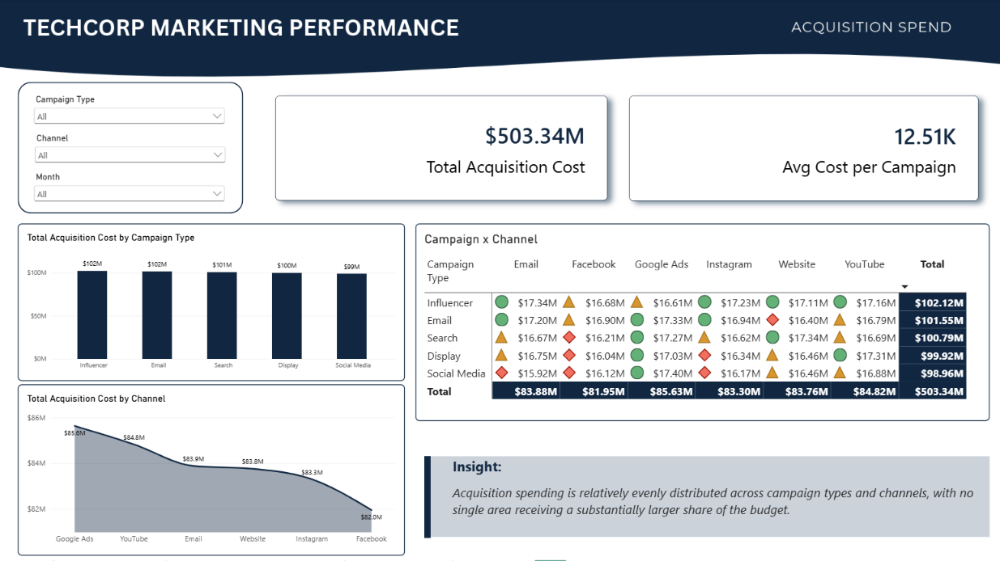
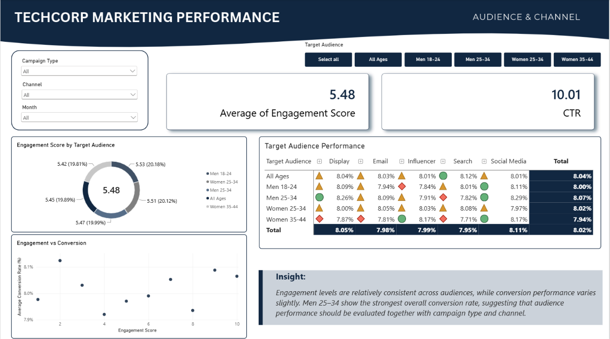
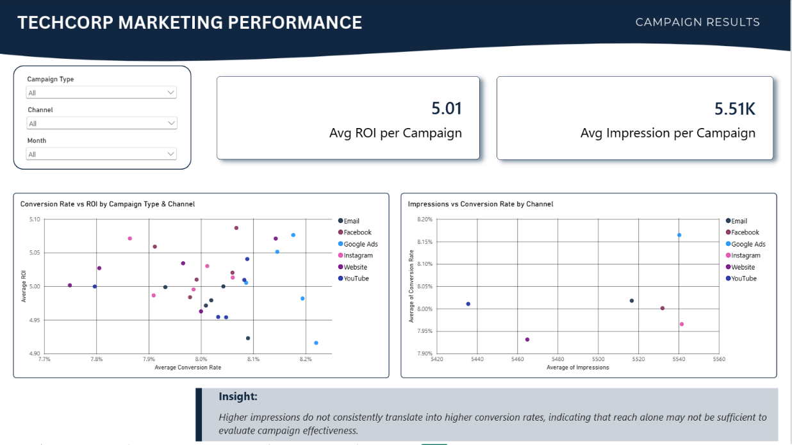

# TechCorp: Marketing Campaign Performance Analysis


> Turning 40,237 campaign records into clear, decision-oriented insights on where marketing money goes, who it reaches, and what it returns.

---

## Table of Contents

1. [Project Overview](#project-overview)
2. [Business Problem](#business-problem)
3. [Dataset](#dataset)
4. [Main Question and Answer](#main-question-and-answer)
5. [SQL Analysis](#sql-analysis)
6. [Power BI Dashboard](#power-bi-dashboard)
7. [Recommendation](#recommendation)
8. [Limitations and Next Steps](#limitations-and-next-steps)

---

## Project Overview

| | |
|---|---|
| **Project type** | Simulated client case study |
| **Role** | Marketing Data Analyst |
| **Tools** | MySQL, SQL, Power BI |
| **Data source** | Public Kaggle dataset, filtered to TechCorp |

This project analyzes how TechCorp's acquisition spending, audience targeting, channel performance, and campaign results vary across campaign types and channels.

> **Note:** *TechCorp* is a fictional name used to frame the public dataset as a realistic client-style business case.

## Business Problem

TechCorp runs campaigns across multiple campaign types, channels, and target audiences. The marketing team has campaign-level data but needs a clearer view of:

- Where acquisition spending is going
- Which audiences and channels show stronger engagement and conversion
- How results vary across campaign and channel combinations
- Whether higher reach is associated with stronger conversion
- Where future investment could be focused

## Dataset

- **Source:** [Marketing Campaign Performance Dataset](https://www.kaggle.com/datasets/manishabhatt22/marketing-campaign-performance-dataset) by Manishabhatt22 (Kaggle)
- **Filter applied:** `Company = TechCorp`
- **Size:** 40,237 records, 16 columns

**Key fields:** `Campaign_ID`, `Company`, `Campaign_Type`, `Target_Audience`, `Duration`, `Channel_Used`, `Conversion_Rate`, `Acquisition_Cost`, `ROI`, `Location`, `Language`, `Clicks`, `Impressions`, `Engagement_Score`, `Customer_Segment`, `Date`

---

## Main Question and Answer

> **Does the campaign/channel combination with the highest conversion rate also achieve a low acquisition cost?**

**Short answer: No.**

- The top converter is **Social Media × Google Ads** at **8.22%** average conversion rate.
- In the dashboard's Campaign × Channel cost matrix, that same combination has the **highest total acquisition cost ($17.40M)**, against a range of $15.92M to $17.40M.

So the best-converting combination is not a low-cost one. Because these are *total* costs, part of the difference may reflect campaign volume, which is why cost per conversion is listed as a next step below.

---

## SQL Analysis

Six supporting questions were answered in MySQL. Queries below are shortened with `LIMIT 1` to show the top result.

### 1. Which Campaign + Channel combination converts best?

```sql
SELECT
    Campaign_Type,
    Channel_Used,
    AVG(Conversion_Rate) AS Avg_Conversion_Rate
FROM techcorp_marketing_campaign
GROUP BY Campaign_Type, Channel_Used
ORDER BY Avg_Conversion_Rate DESC
LIMIT 1;
```

| Campaign_Type | Channel_Used | Avg_Conversion_Rate |
|---|---|---|
| Social Media | Google Ads | 8.22% |

**Finding:** Social Media + Google Ads has the highest average conversion rate at about 8.22%.

### 2. Which Campaign + Channel combination performs best for each target audience?

```sql
WITH CampaignPerformance AS (
    SELECT
        Target_Audience,
        Campaign_Type,
        Channel_Used,
        AVG(Conversion_Rate) * 100 AS Avg_Conversion_Rate
    FROM techcorp_marketing_campaign
    GROUP BY Campaign_Type, Channel_Used, Target_Audience
),
BestAudiencePerformance AS (
    SELECT
        Target_Audience,
        MAX(Avg_Conversion_Rate) AS Max_Conversion_Rate
    FROM CampaignPerformance
    GROUP BY Target_Audience
)
SELECT
    p.Target_Audience,
    p.Campaign_Type,
    p.Channel_Used,
    p.Avg_Conversion_Rate
FROM CampaignPerformance p
JOIN BestAudiencePerformance b
    ON p.Target_Audience = b.Target_Audience
   AND p.Avg_Conversion_Rate = b.Max_Conversion_Rate
ORDER BY p.Target_Audience;
```

| Target_Audience | Campaign_Type | Channel_Used | Avg_Conversion_Rate |
|---|---|---|---|
| All Ages | Social Media | Google Ads | 8.45% |
| Men 18-24 | Display | YouTube | 8.52% |
| Men 25-34 | Display | Google Ads | 8.62% |
| Women 25-34 | Search | YouTube | 8.44% |
| Women 35-44 | Social Media | Facebook | 8.49% |

**Finding:** The best Campaign Type + Channel combination differs for every audience. There is no single winning formula.

### 3. Which channel has the strongest click-through rate?

```sql
SELECT
    Channel_Used,
    SUM(Clicks) / SUM(Impressions) * 100 AS CTR
FROM techcorp_marketing_campaign
GROUP BY Channel_Used
ORDER BY CTR DESC
LIMIT 1;
```

| Channel_Used | CTR |
|---|---|
| YouTube | 10.13% |

**Finding:** YouTube generated the strongest CTR among all channels.

### 4. Which Customer Segment + Channel combination has the highest engagement?

```sql
SELECT
    Customer_Segment,
    Channel_Used,
    AVG(Engagement_Score) AS Avg_Engagement_Score
FROM techcorp_marketing_campaign
GROUP BY Customer_Segment, Channel_Used
ORDER BY Avg_Engagement_Score DESC
LIMIT 1;
```

| Customer_Segment | Channel_Used | Avg_Engagement_Score |
|---|---|---|
| Outdoor Adventurers | Website | 5.63 |

**Finding:** Outdoor Adventurers + Website had the highest average engagement score.

### 5. Does higher engagement lead to higher conversion?

**Finding:** Across campaign/channel combinations, average engagement score and average conversion rate show a **weak positive relationship (r = 0.24)**. Higher engagement is somewhat associated with higher conversion, but the link is not strong.

### 6. Which target audience converts best?

```sql
SELECT
    Target_Audience,
    AVG(Conversion_Rate) * 100 AS Avg_Conversion_Rate
FROM techcorp_marketing_campaign
GROUP BY Target_Audience
ORDER BY Avg_Conversion_Rate DESC
LIMIT 1;
```

| Target_Audience | Avg_Conversion_Rate |
|---|---|
| Men 25-34 | 8.07% |

**Finding:** Men aged 25-34 showed the highest average conversion rate.

---

## Power BI Dashboard

The dashboard has three pages that follow the marketing story: **where the money goes → who we reach and how → what results we get.**

### Page 1: Acquisition Spend

*How is TechCorp spending its acquisition budget across campaign types and channels?*



- Total acquisition cost: **$503.34M**; average cost per campaign: **$12.51K**
- Spend is evenly distributed across campaign types, from **$99M to $102M**
- Highest-spending campaign type: **Influencer ($102.12M)**, followed closely by Email ($101.55M)
- Highest-spending channel: **Google Ads ($85.63M)**
- Highest Campaign × Channel spend: **Social Media × Google Ads ($17.40M)**; lowest: **Social Media × Email ($15.92M)**

**Insight:** Spending is relatively even across campaign types and channels, with no single area receiving a substantially larger share of the budget.

### Page 2: Audience & Channel

*Who are we targeting, and which channels reach different audiences?*



- Average engagement score: **5.48 / 10**; CTR: **10.01%**
- Engagement is consistent across audiences, ranging from **5.42 to 5.53**
- Highest conversion: **Men 25-34 (8.07%)**; lowest: **Women 35-44 (7.94%)**
- Across campaign type and audience combinations, conversion ranges from **7.71% to 8.29%**
- Engagement vs conversion shows no strong visible pattern

**Insight:** Engagement alone does not differentiate audience performance. Men 25-34 convert best overall, but the small gaps suggest campaign type and channel also play an important role.

### Page 3: Campaign Results

*What results are TechCorp's campaigns delivering?*



- Average ROI per campaign: **5.01**; average impressions per campaign: **5.51K**
- Conversion rates range from about **7.7% to 8.2%**; ROI from about **4.9 to 5.1**
- Google Ads has among the highest average impressions (about **5.54K**) and a relatively high conversion rate (about **8.17%**)
- Higher impressions do not consistently translate into higher conversion across channels

**Insight:** Results are relatively consistent overall. Reach alone is not enough to judge campaign effectiveness; it should be read alongside outcome metrics.

---

## Recommendation

Acquisition cost, conversion rate, and ROI differ only slightly across campaigns and channels. TechCorp should evaluate whether an evenly distributed budget is the most effective approach. The team could consider prioritizing campaign and channel combinations that consistently sit at the stronger end of the performance range, while monitoring whether increased investment actually improves results.

## Limitations and Next Steps

- **Small spreads:** Differences between groups are narrow (for example, conversion from about 7.7% to 8.3%), so findings should be treated as directional and tested before reallocating budget.
- **Totals vs. efficiency:** The cost matrix shows *total* spend, which is influenced by campaign count. Next step: calculate **cost per conversion** and **average cost per campaign** by combination.
- **Statistical testing:** Add significance tests or confidence intervals to check whether the observed differences are meaningful.
- **Time trends:** Use the `Date` field to examine seasonality and month-over-month changes.

---

## Repository Structure

```
├── README.md
├── dataset/
│   └── techcorp_marketing_campaign_dataset.csv
├── sql/
│   └── techcorp_analysis.sql
├── powerbi/
│   └── TechCorp_Marketing_Dashboard.pbix
└── images/
    ├── page1_acquisition_spend.png
    ├── page2_audience_channel.png
    └── page3_campaign_results.png
```

## Contact

**[Sameera]** | Marketing Data Analyst
[LinkedIn](www.linkedin.com/in/sameera-r-4226a6392) · [Email](samlearnsai2025@gmail.com) 